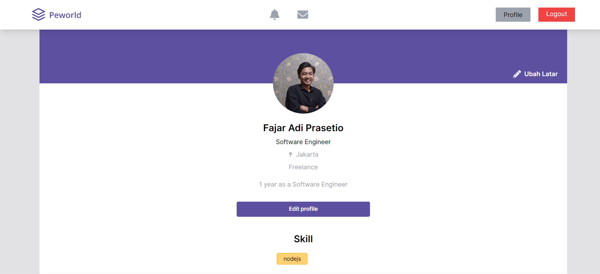
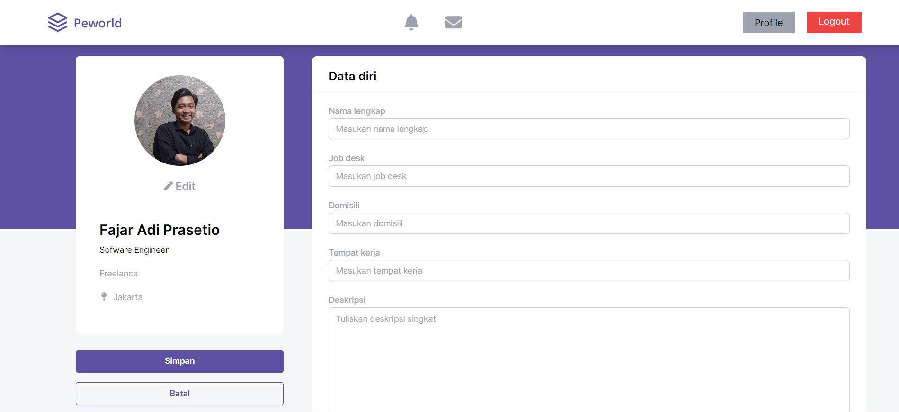

# Peworld Portfolio  📝👔🔍

## Project Description 🚀

Peworld offers a range of features designed to facilitate job search and recruitment. With a user-friendly interface, job seekers can easily search and explore available job opportunities. The platform aims to connect job seekers with potential employers, streamlining the job application process.

## Technologies Used 💻🛠️

The Peworld project is built using the following technologies:

- HTML
- CSS
- JavaScript
- Tailwind CSS
- NEXT.JS (React framework)

## Features ✨🔍

- User-friendly job search and exploration
- Job application management
- Employer recruiting
- Candidate profile creation and editing
- Seamless user experience with NEXT.JS

## Screenshots 📸

<table>
   <tr>
    <td>Home Page</td>
    <td>Profile Page</td>
  </tr>
   <tr>
    <td></td>
    <td> </td>
  </tr>
   <tr>
    <td>Login Page</td>
    <td>Register Page</td>
  </tr>
   <tr>
    <td></td>
    <td></td>
  </tr>
<!--     <td>Edit Page</td>
    <td>Register Page</td>
  </tr>
   <tr>
    <td></td>
    <td></td>
  </tr> -->
   <tr>
    <td>Jobs List Page</td>
    <td>Edit Page</td>
  </tr>
   <tr>
    <td></td>
    <td></td>
  </tr>
</table>

## Getting Started 🏁🚀

To set up the Peworld project locally, follow these steps:

1. Clone the backend repository from the provided link.
2. Install the required dependencies using npm.
3. Set up your database and update the configuration accordingly.
4. Ensure you have Node.js and npm installed on your system.
5. Start the development server using the command `npm run dev`.
6. Access the project through your preferred web browser.

## Contributions 🤝🌟

Contributions to the Peworld project are welcome. If you find any issues or have suggestions for improvements, please feel free to open an issue or create a pull request in this repository.

## License 📜📝

This project is licensed under the MIT License - see the [LICENSE](LICENSE) file for details.

## Contact 📞📧

If you have any questions or inquiries regarding this project, feel free to contact me at [fajaradiprasetio@gmail.com](mailto:fajaradiprasetio@gmail.com).

---

Thank you for exploring my Hire Job portfolio. I hope this project showcases my skills and enthusiasm for creating innovative solutions in the job recruitment industry.
